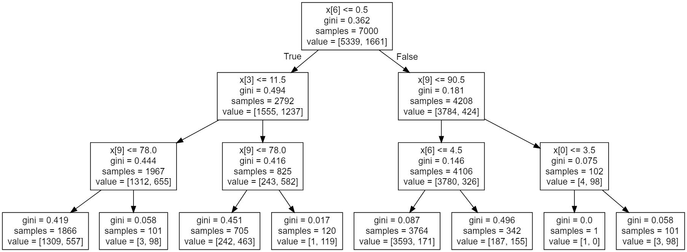

# Decision-Tree-Implementation
Implemented Decision Trees from Scratch 

Trained on Following Dataset: https://archive.ics.uci.edu/ml/datasets/adult

<pre>
TREE
+-- [SPLIT: x4 = 2]
|	+-- [SPLIT: x6 = 3]
|	|	+-- [SPLIT: x9 = 97]
|	|	|	+-- [LABEL = 0]
|	|	+-- [SPLIT: x9 = 97]
|	|	|	+-- [LABEL = 1]
|	+-- [SPLIT: x6 = 3]
|	|	+-- [SPLIT: x1 = 6]
|	|	|	+-- [LABEL = 0]
|	|	+-- [SPLIT: x1 = 6]
|	|	|	+-- [LABEL = 0]
+-- [SPLIT: x4 = 2]
|	+-- [SPLIT: x5 = 4]
|	|	+-- [SPLIT: x5 = 10]
|	|	|	+-- [LABEL = 0]
|	|	+-- [SPLIT: x5 = 10]
|	|	|	+-- [LABEL = 1]
|	+-- [SPLIT: x5 = 4]
|	|	+-- [SPLIT: x2 = 12]
|	|	|	+-- [LABEL = 1]
|	|	+-- [SPLIT: x2 = 12]
|	|	|	+-- [LABEL = 1]
</pre>

Confusion matrix: [[298, 420],
                   [134, 2148]]
Implementation Test Error = 18.47%.

Scikit Learn's Tree:

Confusion matrix of sk: [[341, 377], 
                         [107, 2175]]
Scikit-learns’s test Error = 16.13%.
